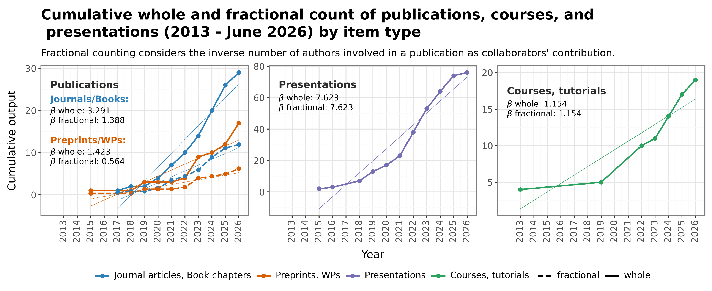

# Introduction

I am Aliakbar Akbaritabar (Ali), Assistant Professor of Computational Social Science at the University of Rostock and Research Scientist at the Max Planck Institute for Demographic Research (since 2021).

I am a computational social scientist with a sociology background, focusing on social data science, demography, high-skilled migration, inequalities in the science system, and reproducible open science.

I hold a PhD in Economic Sociology and Labor Studies (University of Milan) and a PhD in Social Welfare (Allameh Tabataba'i University of Tehran).

I am open to tenure-track, tenured, and permanent positions in computational social science, social data science, demography, and sociology; below you can find my CV, publications, open materials, course resources, and presentation archive. Here is an overview of my research and teaching from 2013 to June 2026.



<hr />

## CV
See and download my CV [here](./CV_MD/Aliakbar_Akbaritabar_CV.html).

<hr />

## Recent Publications

For a complete and up-to-date publication list:

- [Google Scholar](https://scholar.google.com/citations?user=zufgVroAAAAJ&hl=en)
- [ORCID](https://orcid.org/0000-0003-3828-1533)
- [OpenAlex](https://openalex.org/works?filter=authorships.author.id:a5110124154\|a5067953991\|a5075794287)

<hr />

## Replication Materials, Code, and Data

- [Zenodo](https://zenodo.org/search?q=metadata.creators.person_or_org.name%3A%22Akbaritabar%2C%20Aliakbar%22)
- [GitHub](https://github.com/akbaritabar)
- [GitLab](https://gitlab.com/akbaritabar)

<hr />

## Courses and Syllabi

Current course syllabi (University of Rostock and MPIDR) are available [here](./Courses_Syllabus.html).

Selected openly available course materials:

- [Introduction to Computational Social Science (2025)](https://doi.org/10.5281/zenodo.21419599)
- [Computational Approaches to Migration Research (2025-2026)](https://doi.org/10.5281/zenodo.21419603)
- [Interactive Self-Paced Course on Git, GitHub, and Reproducible Collaboration (2026)](https://doi.org/10.5281/zenodo.21439793)
- [Introduction to Demographic Methods (2026)](https://doi.org/10.5281/zenodo.21419594)

<hr />

## Open Science Demography

With several colleagues, we have started the Open Science Demography, a community of demographers and social scientists committed to open science practices.

- Community: [OpenScienceDemography](https://github.com/OpenScienceDemography)
- Resource list: [Awesome Demographic Methods](https://opensciencedemography.github.io/awesome-demographic-methods/)

In June 2026 at the European Population Conference (University of Bologna), Tom Theile and I received the EAPS Open Science and Outreach Award for Population Studies for contributions to the [Scholarly Migration Database](https://www.scholarlymigration.org/). 

Award details: [EAPS Outreach Award](https://eaps.nl/page/Outreach-award)

<hr />

## Computational Social Science Events Worldwide

I maintain a public calendar of computational social science events.  
Read more and subscribe [here](./CV_MD/CSS_events_calendar.html).

<iframe src="https://calendar.google.com/calendar/embed?src=19jm0329h91akpv0srml6c24ec%40group.calendar.google.com&ctz=Europe%2FRome" style="border: 0" width="600" height="550" frameborder="0" scrolling="no"></iframe>

<hr />

## Selected Posts from My Previous Website

My previous website included posts on data science and computational methods. Selected posts:

- [Parallelized and Out-of-Memory Data Analysis with Dask, DuckDB, and DBeaver (ORCID 2019 XML case)](./CV_MD/out_of_memory_ETL.html)
- [How to Use a Wikidata Full JSON Dump](./CV_MD/How_to_use_a_Wikidata_dump.html)
- [Key Actors in HERSS: Flexdashboard in R](./CV_MD/herss_world_map_flexdashboard.html)
- [Publication-Ready, Replicable Network Visualizations from Visone to R](./CV_MD/replicable_network_vis.html)
- [Google Scholar Shiny App](./CV_MD/gScholarShinyApp.html) ([video intro](https://www.youtube.com/watch?v=NZ5WdBnZ-CE))
- [Git and GitHub/GitLab for Academic Writing (advanced topics update)](./CV_MD/git_github_for_academic_writing.html)
- [Quantitative sociology of academic work in an era of hypercompetition and rankings](https://akbaritabar.github.io/CV_MD/UNIMI_thesis/)

<hr />

## Contact

Email: akbaritabar [at] demogr.mpg.de  
[LinkedIn](https://www.linkedin.com/in/akbaritabar/) | [BlueSky](https://bsky.app/profile/akbaritabar.bsky.social) | [Mastodon](https://mastodon.social/@Akbaritabar) | Twitter: @akbaritabar

<hr />

## PDF Files of Presentations, Course Materials, and Dissertations

Presentation files are available under GPL-3.0 in this repository:  
[akbaritabar/akbaritabar.github.io](https://github.com/akbaritabar/akbaritabar.github.io)

**Citation template**:

> Akbaritabar, A. (2022). Intro, CV and archive of presentations by Aliakbar Akbaritabar. https://github.com/akbaritabar/akbaritabar.github.io/docs/NAME-OF-SPECIFIC-PRESENTATION-FILE

```bibtex
@misc{akbaritabarIntroCVArchive2022,
    title = {Intro, {CV} and archive of presentations by {Aliakbar} {Akbaritabar}},
    copyright = {GPL-3.0},
    url = {https://github.com/akbaritabar/akbaritabar.github.io},
    abstract = {Intro, CV and archive of presentations by Aliakbar Akbaritabar (https://akbaritabar.github.io/), use under GPL-3.0 License},
    urldate = {2022-04-17},
    author = {Akbaritabar, Aliakbar},
    year = {2022},
    note = {original-date: 2022-01-11T21:20:21Z},
}

```

Click on links to open each year's presentations.

<!-- pdfs here -->

[./CV_MD/Akbaritabar_CV.pdf](./CV_MD.html)

[./CV_MD/20190411_Akbaritabar_2nd_PhD_Thesis_HyperCompetitiveAcademia.pdf](./CV_MD.html)

[./CV_MD/20170613_Akbaritabar_1st_PhD_Thesis_CyberSocialCapital_inPersian.pdf](./CV_MD.html)

[./CV_MD/20110704_Akbaritabar_MA_Thesis_SocialNetworkAnalysis_inPersian.pdf](./CV_MD.html)

[./Courses_Syllabus/Course_introduction_to_demographic_methods_00_Course_Syllabus.pdf](./Courses_Syllabus.html)

[./Courses_Syllabus/Course_introduction_to_CSS_Syllabus.pdf](./Courses_Syllabus.html)

[./Courses_Syllabus/Course_computational_approaches_to_migration_research_Syllabus.pdf](./Courses_Syllabus.html)

[./2024/20241113_University_of_Washington_ML_Nationality.pdf](./2024.html)

[./2024/20241018_UN_IOM_Berlin_Scholarly_Migration_Database.pdf](./2024.html)

[./2024/20240919_STI_Berlin_mobility_of_talents.pdf](./2024.html)

[./2024/20240613_EPC_ML_Nationality_SciMigration.pdf](./2024.html)

[./2024/20240413_PAA_poster_2_ML_Nationality.pdf](./2024.html)

[./2024/20240413_PAA_poster_1_ScientificCollaboration_Migration.pdf](./2024.html)

[./2024/20240321_CED_Barcelona_myths_stratification.pdf](./2024.html)

[./2023/20231120_Uni_Granada_mobility_workshop_SMD.pdf](./2023.html)

[./2023/20230911_BSPS_UK_internal_international_migr.pdf](./2023.html)

[./2023/20230705_ISSI2023_iDiv_Berlin_Scientific_Collaborations.pdf](./2023.html)

[./2023/20230629_0712_19_20_Sunbelt_NetSci_IC2S2_2023_SubnationalMigration.pdf](./2023.html)

[./2023/20230629_0712_19_20_Sunbelt_NetSci_IC2S2_2023_Stratification.pdf](./2023.html)

[./2023/20230202_PopDays_Italy_InternalInternational.pdf](./2023.html)

[./2022/20220521_African_Science_Day_Rostock_Scholarly_Migration.pdf](./2022.html)

[./2022/20220510_RMZ_HumboldUni_Berlin_Plasticity.pdf](./2022.html)

[./2022/20220422_Akbaritabar_biases_in_science.pdf](./2022.html)

[./2022/20220408_PAA2022_Internal_vs_international_scholarly_mobility_poster.pdf](./2022.html)

[./2022/20220408_PAA2022_Internal_vs_international_scholarly_mobility_flash_talk.pdf](./2022.html)

[./2022/20220221_MichiganUni_dask_duckdb_dbeaver_tutorial.pdf](./2022.html)

[./2021/20211214_MPIDR_DCoDe_informal_gathering_quiz.pdf](./2021.html)

[./2021/20211125_ICM_Paris_Akbaritabar_Zhao_Zagheni_Internal_vs_international_scholarly_mobility.pdf](./2021.html)

[./2021/20211120_IPCIUSSP_Akbaritabar_Zhao_Zagheni_Internal_vs_international_scholarly_mobility.pdf](./2021.html)

[./2021/20210928_DZHW_workshop_scholarly_mobility.pdf](./2021.html)

[./2021/20210707_27_Networks2021_IC2S2.pdf](./2021.html)

[./2020/20201023_26_DZHW_biblioGroup_DEKiF_ppt.pdf](./2020.html)

[./2020/20200930_2nd_PEERE_conference_reflistchanges.pdf](./2020.html)

[./2020/20200717_INSNA_Sunbelt_virtual.pdf](./2020.html)

[./2020/20200624_Mitchel_centre_for_SNA_Manchester_Zoominar.pdf](./2020.html)

[./2020/20200603_MPIDR_seminar_job_interview.pdf](./2020.html)

[./2020/20200506_UCL_Workshop_HE_internationalization.pdf](./2020.html)

[./2020/20200228_DEKiF_colloquium_Dusseldorf.pdf](./2020.html)

[./2020/20200121_DZHW_seminar_DEKiF_progress.pdf](./2020.html)

[./2019/20191121_HU_Berlin_Seminar_Network_Analysis.pdf](./2019.html)

[./2019/20191120_DZHW_biblioGroup_wos_disambiguation.pdf](./2019.html)

[./2019/20191017_DZHW_seminar_DEKiF_bibliometric_case.pdf](./2019.html)

[./2019/20190906_CNDSS_Sapienza_Rome.pdf](./2019.html)

[./2019/20190905_ISSI_STI_Rome.pdf](./2019.html)

[./2019/20190822_CASS_visit_DZHW_HERSS.pdf](./2019.html)

[./2019/20190718_IC2S2_computational_social_science.pdf](./2019.html)

[./2019/20190716_dzhw_report_ppt_markdown_template.pdf](./2019.html)

[./2019/20190618_University_of_Bielefeld_workshop_open_access.pdf](./2019.html)

[./2019/20190613_Academia_in_the_Age_of_Comparison_Hanover_HERSS_Poster.pdf](./2019.html)

[./2019/20190416_UNIMI_PhD_defense_speech.pdf](./2019.html)

[./2019/20190416_UNIMI_PhD_defense.pdf](./2019.html)

[./2019/20190219_HERSS_DZHW_seminar.pdf](./2019.html)

[./2018/20180629_INSNA_sunbelt_Utrecht.pdf](./2018.html)

[./2018/20180425_DZHW_job_interview.pdf](./2018.html)

[./2018/20180424_UCD_Dynamics_lab_with_Diane_Payne.pdf](./2018.html)

[./2018/20180312_UNIMI_yearly_colloquium.pdf](./2018.html)

[./2018/20180309_PEERE_Rome_poster.pdf](./2018.html)

[./2018/20180309_PEERE_Rome.pdf](./2018.html)

[./2018/20180216_CWTS_seminars.pdf](./2018.html)

[./2018/20180110_UNIBS_GECS_seminar.pdf](./2018.html)

[./2017/20170929_UNIBS_notte_ricercatori_GECS.pdf](./2017.html)

[./2017/20170929_UNIBS_notte_ricercatori_GECS_broshure.pdf](./2017.html)

[./2017/20170720_Iranian_sociological_association.pdf](./2017.html)

[./2017/20170628_UNIMI_yearly_colloquium.pdf](./2017.html)

[./2016/20161023_UNIMI_yearly_colloquium.pdf](./2016.html)

[./2016/20160628_UNIMI_yearly_colloquium.pdf](./2016.html)

[./2016/20160624_UNIBS_ABM_school.pdf](./2016.html)

[./2016/20160618_EUSN_Paris_GScholars_collaboartion.pdf](./2016.html)

[./2016/20160526_UNIMI_inequalities_social_capital.pdf](./2016.html)

[./2016/20160426_UNIMI_comparative_employment_relations_course.pdf](./2016.html)

[./2016/20160306_UNIMI_sociology_of_work.pdf](./2016.html)

[./2016/20160226_UNIMI_behavioral_game_theory.pdf](./2016.html)

[./2016/20160202_UNIMI_ETLM_course.pdf](./2016.html)

[./2016/20160127_UNIMI_comparative_employment_relations_course.pdf](./2016.html)

[./2015/20151202_UNIMI_economic_sociology_course.pdf](./2015.html)

[./2015/20150728_PNAUAB_Barcelona_Spain_shortened.pdf](./2015.html)

[./2015/20150728_PNAUAB_Barcelona_Spain.pdf](./2015.html)

[./2015/20150626_INSNA_Sunbelt_Brighton_UK_cyber_social_capital.pdf](./2015.html)

[./2015/20150517_Kollegg_School_Northwestern_USA_cyber_social_capital_poster.pdf](./2015.html)

[./2015/20150428_cyber_social_capital_Brest_Telecom_Bretagne.pdf](./2015.html)

[./2011_2014/20141203_Meta_analysis_of_Iranian_Social_media_Users.pdf](./2011_2014.html)

[./2011_2014/20141115_onlineSNA_group_intro.pdf](./2011_2014.html)

[./2011_2014/20130813_social_media_youth_lifestyle.pdf](./2011_2014.html)

[./2011_2014/20130729_organizational_networks_analysis.pdf](./2011_2014.html)

[./2011_2014/20121111_SNA_workshop_4_How_to_use_Pajek.pdf](./2011_2014.html)

[./2011_2014/20121111_SNA_workshop_3_Methodological_considerations.pdf](./2011_2014.html)

[./2011_2014/20121111_SNA_workshop_2_Theoretical_considerations.pdf](./2011_2014.html)

[./2011_2014/20121111_SNA_workshop_1_Intro.pdf](./2011_2014.html)

[./2011_2014/20120631_research_methods_for_online_networks.pdf](./2011_2014.html)

[./2011_2014/20120129_SNA_workshop_4_Software_How_to_use_2_pajek.pdf](./2011_2014.html)

[./2011_2014/20120129_SNA_workshop_3_Software_How_to_use_1_nodexl.pdf](./2011_2014.html)

[./2011_2014/20120129_SNA_workshop_2_Methodology_Research_experience.pdf](./2011_2014.html)

[./2011_2014/20120129_SNA_workshop_1_Intro.pdf](./2011_2014.html)

[./2011_2014/20110704_Master_thesis_defense.pdf](./2011_2014.html)

