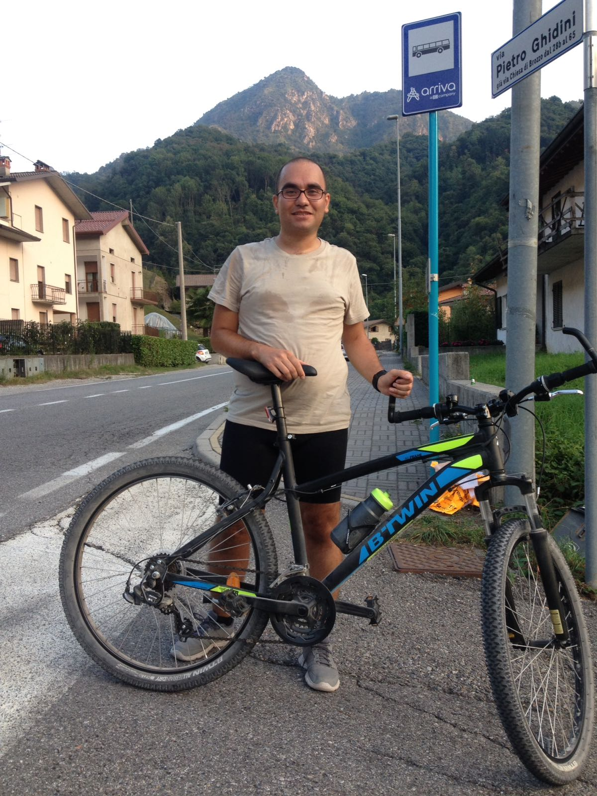

----

Hello there !

I am Ali (the simplest version of Aliakbar Akbaritabar, believe me, I have tried other versions!). Below you find a picture of me in one of my happiest moments. Those moments normally involve a bike [(see my Strava)](https://www.strava.com/athletes/14470649) and my good friends!

I like to call myself a __Social Data Scientist__ (I don't know when it is going to officially become a thing, till then, it is mainly what data scientists are doing plus a sociological approach which is what I have been studying for most of my academic life).

You can find a detailed __CV__ of me [__here__](./3AT_cv.html)
 

 

----

This online CV is built with R Markdown and github pages (based on the simple guide of [Julia Stewart Lowndes](https://jules32.github.io/); you can find it [here](https://jules32.github.io/rmarkdown-website-tutorial/))
