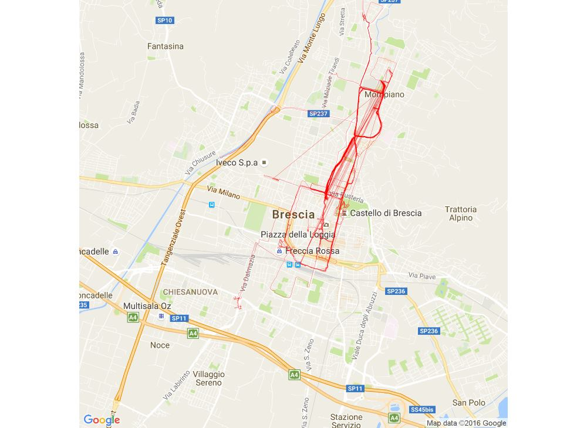

```{r echo=TRUE, message=FALSE, warning=FALSE, paged.print=FALSE}
# clean the R workspace
rm(list = ls())
# load packages
require(tidyverse)
require(leaflet)
# read csv files of GPS coordinates of activities
runs_coordinates <- read.csv("./data/runs_bike_rides/runs_coordinates.csv")
iran_rides_coordinates <- read.csv("./data/runs_bike_rides/iran_rides_coordinates.csv")
milan_rides_coordinates <- read.csv("./data/runs_bike_rides/milan_rides_coordinates.csv")
brescia_rides_coordinates <- read.csv("./data/runs_bike_rides/brescia_rides_coordinates.csv")
free_walks_coordinates <- read.csv("./data/runs_bike_rides/free_walks_coordinates.csv")

# in order to sty DRY (Don't Repeat Yourself) ! I am going to write a small function to call leaflet mapping functions and use it in following sections to avoid writing same code multiple times
my_leaflet_map <- function(activity_data) {
  leaflet() %>% 
    addTiles() %>% 
    addPolylines(lat = activity_data$latitude, 
                 lng = activity_data$longitude)
}


```

As title says clearly, in this short post I am trying to keep motivating myself! After sharing my bike rides or run paths visualized by R on a map on social media (like picture below), I have often got this question from my friends, why are you sharing them?

<br>
<center></center>

<br>

__My answer has been__:

> You know how hard it is to ride a bike or run when it is cold outside?!
I am trying to keep motivating myself! 
These posts are written, first to remind myself that it is doable, then to inspire my friends to move!

Besides above goal, it is a while I have intended to learn a better way to visualize routes and paths with GPS coordinates over maps, in a more interactive way and with possibility to be embedded in [R Markdown docuements](http://rmarkdown.rstudio.com/) like the one you are reading now! 

Before I was using `geom_path` from the amazing `ggplot2` package, to connect the coordinates, (like picture above) recently I heard about `leaflet` package, and here you are going to see different maps of my __bike rides__, __runs__ and __free walking__ paths which are visualized with leaflet `addPolylines`.

In order to capture and export my rides, runs and walks GPS coordinates I am using [Strava](https://www.strava.com/athletes/14470649) which gives `.gpx` format exports of all the activities. Then I use `plotKML` package to import those files in R and build data frames from them. Below I have used the `csv` exports of those data frames, since they include time, elevation and some other information that Strava exports, so I wouldn't suggest you to share your gpx files publicly, as I am not doing here.

## My bike rides
### Bike rides in Milan, Italy
I was not riding much in Milan, it was a total of `r max(milan_rides_coordinates$ride_number)` rides. That was the first time I learned about GPS art ([see here](https://gpsdoodles.com/)) and I created my master piece of [Milan's helmet](https://www.strava.com/routes/7868171)! :D

```{r Milan bike rides, echo=TRUE, message=FALSE, warning=FALSE, paged.print=FALSE}
my_leaflet_map(activity_data = milan_rides_coordinates)

```

<br>

### Bike rides in Iran
For my summer vacations, I paid a two months visit to my country, Iran, after near 11 tough months on 2016. That was an opportunity to start riding! I only had `r max(iran_rides_coordinates$ride_number)` rides, but for longer time and paths compared to my normal to that date.

```{r Iran bike rides, echo=TRUE, message=FALSE, warning=FALSE, paged.print=FALSE}
my_leaflet_map(activity_data = iran_rides_coordinates)

```

<br>

### Bike rides in Brescia, Italy
Here is most of my bike rides which has happened in Brescia, in Italy. A total of `r max(brescia_rides_coordinates$ride_number)` rides so far which is the most part of my __2,634.9 km__ total rides. You can zoom in to have better view of the rides (thanks to `leaflet`'s amazing visualizations!)

```{r Brescia bike rides, echo=TRUE, message=FALSE, warning=FALSE, paged.print=FALSE}
my_leaflet_map(activity_data = brescia_rides_coordinates)

```

<br>


## My runs in Brescia, Italy
Here there is the places I have run, that have been mostly in Brescia, a total of `r max(runs_coordinates$run_number)` runs for a total distance of __168.7 km__.

```{r Brescia runs, echo=TRUE, message=FALSE, warning=FALSE, paged.print=FALSE}
my_leaflet_map(activity_data = runs_coordinates)

```

<br>

## My Free walks
At the end I have put the _free walks_ paths. This includes places I have visited and walked around, like _Verona, Trento, Ljubljana and Salo_. A total of `r max(free_walks_coordinates$walk_number)` walks. Remember to __zoom in__.

There is one thing that I am still trying to learn in `leaflet`, and that is how to draw multiple `polylines` without attaching the end point of last one to the start point of the next! In below visualization, if you zoom in, you will see that my walks in each of the places I mentioned above are connected to each other. I didn't put time to separate them in different csv files as I have done for my bike rides above, but I need to figure out how to visualize them without having this problem, __any suggestion would be very much welcomed__.

```{r Free walks, echo=TRUE, message=FALSE, warning=FALSE, paged.print=FALSE}
my_leaflet_map(activity_data = free_walks_coordinates)

```

<br>

### Ideas to change/develop this post further

- have a look at how to use only one CSV file of coordinates, having a column that separates the type of activity, then ploting different groups in each call to function in leaflet to reduce the clutter and data you read and use
- also have a look if it is possible to use _clustering markers_ that is used on circles and markers for polylines in leaflet, then you can have all activities on same map with filtering (see how is it possible to put filters and legend on same map) (for this you can have a look at professor from netherlands who was putting his bike rides on a personal website himself for reference here: http://tracklog.studioblueplanet.net/)
- look into how is it possible to use gps coordinates as if they were nodes in network analysis terms, the see movements as links between them.
- Look into this experimental R package to work with Strava API (https://github.com/fawda123/rStrava)

```{r}
require(igraph)
# g <- graph_from_edgelist()
# graph_from_data_frame()

```

